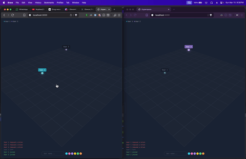

# Hyperspace

Real-time multiplayer isometric sandbox. Zero application JavaScript.



## How It Works

```
  Browser A              SpacetimeDB (Rust → Wasm)              Browser B
  ─────────              ──────────────────────────              ─────────

  click cell
       │
       ▼
  stdb.callReducer ──────► create_brick(x, y)
  ('create_brick',        ┌──────────────────────┐
   [3, 5])                │ INSERT INTO brick     │
        ┌─────────────────│ ...                   │
        │                 │ broadcast()           │──────────────────┐
        │                 │  for each online user │                  │
        │                 │    render(template,   │                  │
        │                 │      viewer=identity) │                  │
        │                 └──────────┬────────────┘                  │
        │                            │                               │
        │           ┌────────────────┴────────────────┐              │
        │           ▼                                 ▼              │
        │   html_broadcast                    html_broadcast         │
        │   ┌─────────────────┐               ┌─────────────────┐   │
        │   │ identity: Alice │               │ identity: Bob   │   │
        │   │ html: "<div..." │               │ html: "<div..." │   │
        │   └────────┬────────┘               └────────┬────────┘   │
        │            │ RLS filter:                      │            │
        │            │ each client only                 │            │
        │            │ gets their own row               │            │
        │            ▼                                  ▼            │
        │   Idiomorph.morph(#app)              Idiomorph.morph(#app) │
        │                                                           │
        ▼                                                           ▼
  ┌──────────────┐                                    ┌──────────────┐
  │ Block appears │                                   │ Block appears │
  │ (your cursor  │                                   │ (your cursor  │
  │  is brighter) │                                   │  is brighter) │
  └──────────────┘                                    └──────────────┘
```

Every mutation (place, delete, drag, move, set name, set color) follows this exact flow. The server re-renders personalized HTML for every connected client on every state change.

## The Entire Interaction Model

```html
<!-- Place a brick: click a grid cell -->
<button hx-on:click="stdb.callReducer('create_brick', [3, 5])">

<!-- Delete a brick: Shift+click -->
<div hx-on:mousedown="
    if (event.shiftKey) { stdb.callReducer('delete_brick', [id]); return; }
    /* otherwise start drag */
">

<!-- Delete mode visuals: pure CSS via data attribute -->
<body hx-on:keydown="if(event.key==='Shift') this.setAttribute('data-delete-mode','')">
<div class="group-data-[delete-mode]/body:group-hover/brick:border-red-500">

<!-- Set name: Enter key -->
<input hx-on:keydown="if(event.key==='Enter') stdb.callReducer('set_name', [this.value])">
```

No application JavaScript files. No `<script>` blocks. Just HTML attributes calling server reducers.

## Data Model

```
┌─────────────────────────────────────────────────────────────────────┐
│ SpacetimeDB Tables                                                  │
├──────────────────┬──────────────────────────────────────────────────┤
│ Brick            │ id, position{x,y,z}, color, dragged_by?         │
│ User             │ identity, name, color, online                    │
│ Cursor           │ identity, position{x,y,z}                       │
│ Event            │ id, kind, identity, brick_id?, timestamp         │
├──────────────────┼──────────────────────────────────────────────────┤
│ HtmlBroadcast    │ identity, html                                   │
│ (event table)    │ RLS: each client only receives their own row     │
└──────────────────┴──────────────────────────────────────────────────┘
```

## Project Structure

```
src/
  lib.rs          GET / → full HTML page                         13 lines
  models.rs       tables + types                                134 lines
  reducers.rs     mutations + lifecycle + broadcast()            255 lines
  render.rs       MiniJinja template engine                     127 lines
templates/
  index.html.j2   entire UI                                     217 lines
static/js/
  htmx-spacetimedb.js   generic SpacetimeDB ↔ htmx bridge      214 lines
```

## SpacetimeDB

This project runs on a [custom fork](https://github.com/scriptogre/SpacetimeDB/tree/hypermedia) of SpacetimeDB that adds an **HTTP route system**.

```
  Official SpacetimeDB           Patched (hypermedia branch)
  ─────────────────────          ──────────────────────────────

  WebSocket reducers     ✓       WebSocket reducers            ✓
  Client subscriptions   ✓       Client subscriptions          ✓
  Row-level security     ✓       Row-level security            ✓
                                 #[get], #[post], ... routes   ✓  ◄── new
                                 Html, Json response types     ✓  ◄── new
                                 HttpRequest (headers, etc.)   ✓  ◄── new
                                 Static file serving           ✓  ◄── new
```

Without this patch, `GET /` couldn't return server-rendered HTML from inside the module, and you'd need Rocket or Axum sitting in front, breaking the single-runtime model.

```rust
// This is what the patch enables:
#[get("/")]
fn index(ctx: &mut ProcedureContext, _req: HttpRequest) -> Html {
    ctx.with_tx(|tx| Html(render::render_page(&tx.db, None)))
}
```

## Running

Requires the patched SpacetimeDB built locally as a sibling directory (`../SpacetimeDB` on the `hypermedia` branch).

```bash
just up      # start SpacetimeDB, publish module
just down    # stop
just test    # Playwright E2E
just check   # clippy + fmt
```

Open `http://localhost:3000` in multiple tabs.
