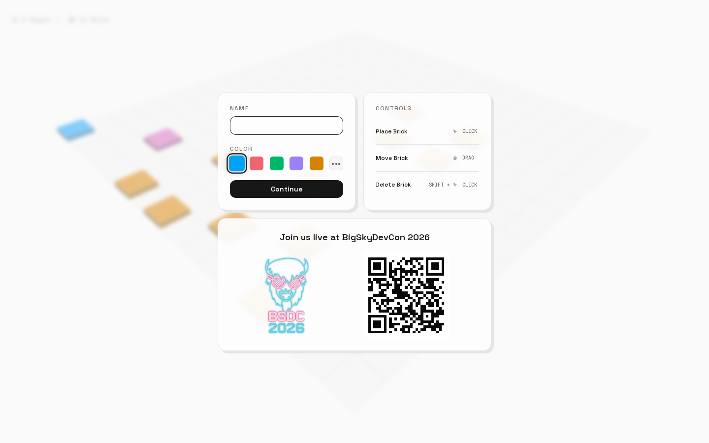
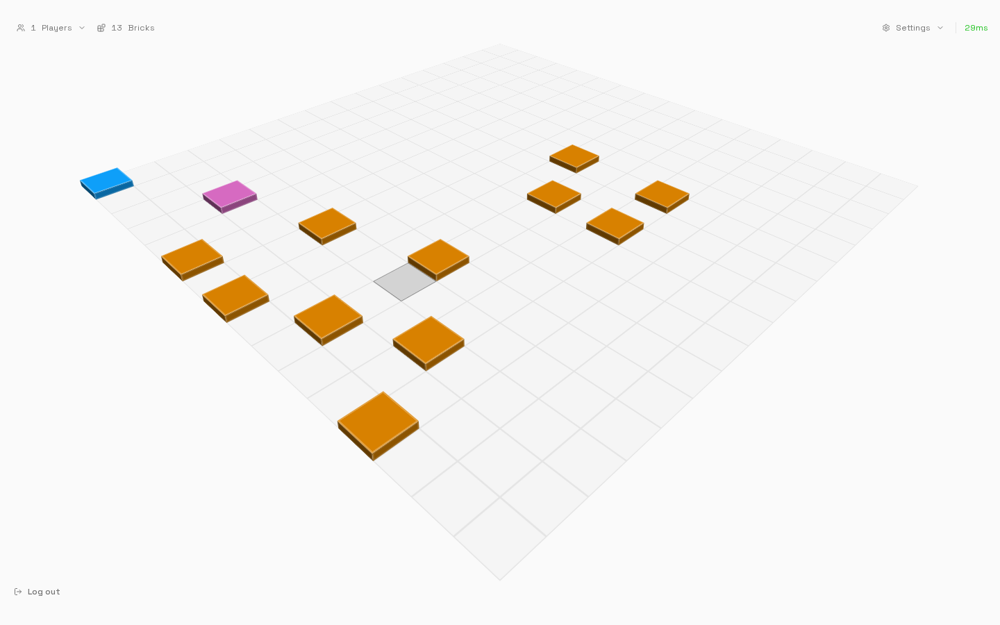
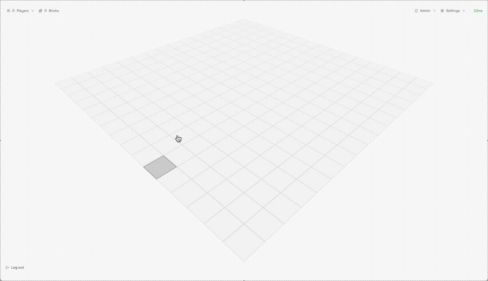
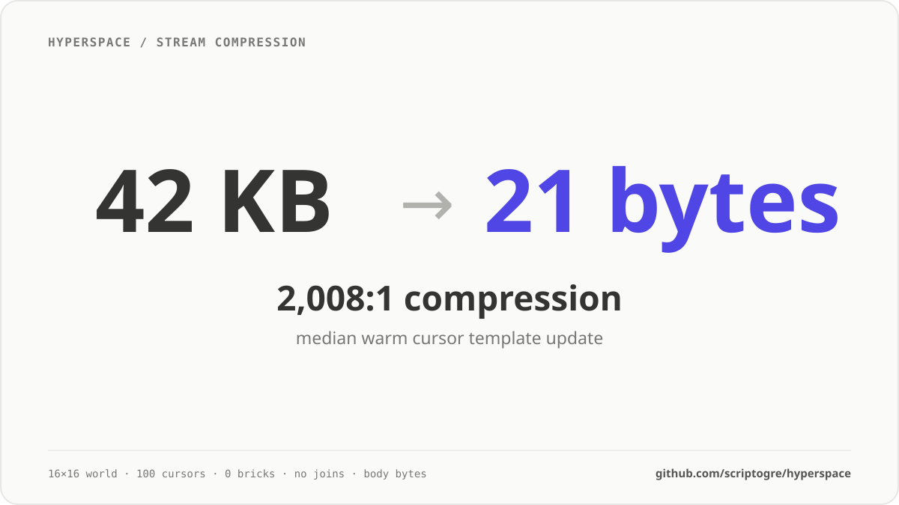

# Hyperspace

Build bricks together in a shared isometric world.

Hyperspace is the demo app for **Real-Time Hypermedia (the htmx way)**. It uses FastAPI, PostgreSQL, htmx, and CSS.

[Play Hyperspace](https://hyperspace.christiantanul.com/) · [View the source](https://github.com/scriptogre/hyperspace)

<p>
  
  
</p>

## How it works

Browser actions send normal HTTP requests. FastAPI updates PostgreSQL, renders the shared world as HTML, and pushes it to every browser over a compressed multipart stream.



Two htmx 4 extensions connect the server-rendered world to local interactions:

- [`hx-multipart`](https://four.htmx.org/extensions/hx-multipart) consumes the stream and morphs each update into `#world`. It vendors the parser from [`fetch-multipart`](https://github.com/scriptogre/fetch-multipart).
- [`hx-live`](https://four.htmx.org/extensions/hx-live) updates reactive attributes for local prediction, controls, and status text.

[`multipart-response`](https://github.com/scriptogre/multipart-response) provides FastAPI multipart response support. It is installed while the current stream route moves from its custom response to `MultipartResponse`.

Client-side prediction keeps brick actions responsive while the server remains the source of truth.

## Run locally

Start the app with Docker:

```bash
just up -d --build
```

Open [localhost:8000](http://localhost:8000), then run the tests:

```bash
just test
```

## Run the conference demo

Start the production stack on port 8000 using this Mac's LAN address:

```bash
just demo
```

The command prints the URL for demo devices and configures the join QR code:

```text
Demo: http://192.168.1.23:8000
```

## Stream compression

[](BENCHMARK.md)

Reproduce the result:

```bash
uv run python -m bench.compression
```

See [`BENCHMARK.md`](BENCHMARK.md) for the workload, limits, and longer runs.

## Deploy

Commit every change, then deploy `main`:

```bash
git push origin main
just deploy
```

`just deploy` checks for a clean working tree, pushes `main`, deploys it to DigitalOcean, and waits for healthy containers.
