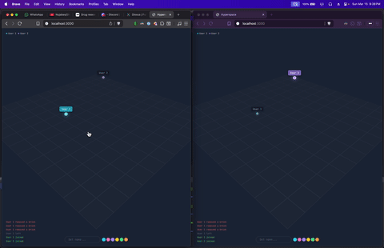

# Hyperspace

Real-time multiplayer isometric sandbox. Zero application JavaScript.



## How It Works

```
  Browser A              SpacetimeDB (Rust → Wasm)              Browser B
  ─────────              ──────────────────────────              ─────────

  click cell
       │
       ▼
  stdb.callReducer ──────► create_brick(x, y)
  ('create_brick',        ┌──────────────────────┐
   [3, 5])                │ INSERT INTO brick     │
        ┌─────────────────│ ...                   │
        │                 │ broadcast()           │──────────────────┐
        │                 │  for each online user │                  │
        │                 │    render(template,   │                  │
        │                 │      viewer=identity) │                  │
        │                 └──────────┬────────────┘                  │
        │                            │                               │
        │           ┌────────────────┴────────────────┐              │
        │           ▼                                 ▼              │
        │   html_broadcast                    html_broadcast         │
        │   ┌─────────────────┐               ┌─────────────────┐   │
        │   │ identity: Alice │               │ identity: Bob   │   │
        │   │ html: "<div..." │               │ html: "<div..." │   │
        │   └────────┬────────┘               └────────┬────────┘   │
        │            │ RLS filter:                      │            │
        │            │ each client only                 │            │
        │            │ gets their own row               │            │
        │            ▼                                  ▼            │
        │   Idiomorph.morph(#app)              Idiomorph.morph(#app) │
        │                                                           │
        ▼                                                           ▼
  ┌──────────────┐                                    ┌──────────────┐
  │ Block appears │                                   │ Block appears │
  │ (your cursor  │                                   │ (your cursor  │
  │  is brighter) │                                   │  is brighter) │
  └──────────────┘                                    └──────────────┘
```

Every mutation (place, delete, drag, move, set name, set color) follows this exact flow. The server re-renders personalized HTML for every connected client on every state change.

## The Entire Interaction Model

```html
<!-- Place a brick: click a grid cell -->
<button hx-on:click="stdb.callReducer('create_brick', [3, 5])">

<!-- Delete a brick: Shift+click -->
<div hx-on:mousedown="
    if (event.shiftKey) { stdb.callReducer('delete_brick', [id]); return; }
    /* otherwise start drag */
">

<!-- Delete mode visuals: pure CSS via data attribute -->
<body hx-on:keydown="if(event.key==='Shift') this.setAttribute('data-delete-mode','')">
<div class="group-data-[delete-mode]/body:group-hover/brick:border-red-500">

<!-- Set name: Enter key -->
<input hx-on:keydown="if(event.key==='Enter') stdb.callReducer('set_name', [this.value])">
```

No application JavaScript files. No `<script>` blocks. Just HTML attributes calling server reducers.

## Data Model

```
┌─────────────────────────────────────────────────────────────────────┐
│ SpacetimeDB Tables                                                  │
├──────────────────┬──────────────────────────────────────────────────┤
│ Brick            │ id, position{x,y,z}, color, dragged_by?         │
│ User             │ identity, name, color, online                    │
│ Cursor           │ identity, position{x,y,z}                       │
│ Event            │ id, kind, identity, brick_id?, timestamp         │
├──────────────────┼──────────────────────────────────────────────────┤
│ HtmlBroadcast    │ identity, html                                   │
│ (event table)    │ RLS: each client only receives their own row     │
└──────────────────┴──────────────────────────────────────────────────┘
```

## Project Structure

```
src/
  lib.rs          GET / → full HTML page                         13 lines
  models.rs       tables + types                                134 lines
  reducers.rs     mutations + lifecycle + broadcast()            255 lines
  render.rs       MiniJinja template engine                     127 lines
templates/
  index.html.j2   entire UI                                     217 lines
static/js/
  htmx-spacetimedb.js   generic SpacetimeDB ↔ htmx bridge      214 lines
```

## SpacetimeDB

Runs on stock **SpacetimeDB 2.4** using its native in-module HTTP handlers (the `unstable` feature). `GET /` returns the server-rendered page straight from the module:

```rust
#[spacetimedb::http::handler]
fn index(ctx: &mut HandlerContext, _req: Request) -> Response {
    let html = ctx.with_tx(|tx| render::render_page(&tx.db, None));
    Response::builder()
        .header("content-type", "text/html; charset=utf-8")
        .body(Body::from_bytes(html))
        .unwrap()
}

#[spacetimedb::http::router]
fn router() -> Router {
    Router::new().get("/", index)
}
```

Stock 2.4 exposes module routes under `/v1/database/<name>/route/...` and serves no static files. A Caddy reverse proxy closes both gaps: it rewrites `/` to the module route and serves `/static` from disk. Locally Caddy runs as a container; in production the homelab Caddy does it.

## Running

Everything is Docker. The server is the official `clockworklabs/spacetime` image; a one-shot `publisher` container builds the wasm and publishes it.

```bash
just up        # server + publisher + caddy + tailwind (foreground)
just down      # stop
just publish   # rebuild wasm + republish after Rust changes
just test      # Playwright E2E against the running stack
just check     # clippy + fmt
```

Open `http://localhost:3000` in multiple tabs. `COMPOSE_FILE` in `.env` selects local vs production (defaults to local).

## Deployment

Production is one container (the SpacetimeDB server); the global homelab Caddy fronts it. Add this block to the homelab Caddyfile:

```
hyperspace.christiantanul.com {
	import cf-tls
	@stdb path /v1/* /internal/*
	handle @stdb { reverse_proxy spacetimedb:3000 }
	handle /static/* {
		root * /srv/hyperspace
		file_server
	}
	handle {
		rewrite * /v1/database/hyperspace/route{uri}
		reverse_proxy spacetimedb:3000
	}
	encode gzip
}
```

Serve `/static` by bind-mounting the (Syncthing-synced) static dir into the caddy container:

```
- /home/chris/Projects/hyperspace/static:/srv/hyperspace/static:ro
```
